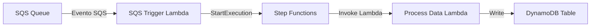
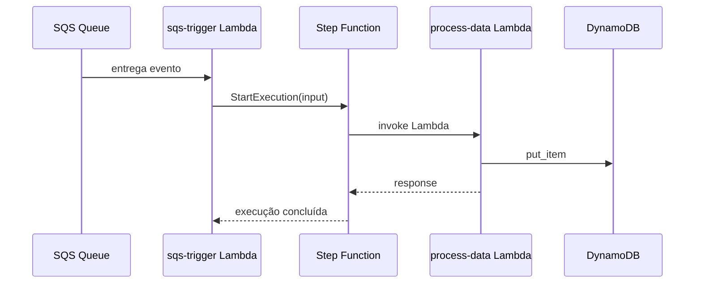

# AWS Lambda Start Step Function

Exemplo completo de integração entre AWS SQS, AWS Lambda e AWS Step Functions usando LocalStack para execução local.

## Visão geral

O projeto demonstra um fluxo onde uma mensagem chega em uma fila SQS, é processada por uma Lambda que inicia uma execução de Step Function, e essa Step Function invoca outra Lambda que grava os dados em um DynamoDB.

O objetivo principal é mostrar como:
- disparar um fluxo de trabalho a partir de um evento SQS;
- usar Lambda como acionador de Step Functions;
- executar toda a infraestrutura localmente com LocalStack.

## Arquitetura

## Sequência de execução

## Como funciona

1. `docker compose up` inicia o LocalStack com serviços SQS, Lambda, Step Functions, DynamoDB, IAM e Logs.
2. O script `docker/init/aws-init.sh` cria a fila SQS, a tabela DynamoDB, as funções Lambda e a máquina de estado.
3. A Lambda `sqs-trigger` é associada como event source mapping da fila SQS.
4. Quando a fila recebe uma mensagem, o LocalStack invoca `sqs-trigger`.
5. `sqs-trigger` chama `StartExecution` na Step Function usando o ARN configurado.
6. A Step Function executa `process-data`, que grava o payload no DynamoDB.

## Componentes do projeto

### Arquivos raíz

- `README.md`: documentação do projeto.
- `Makefile`: comandos convenientes para subir/desligar/reconstruir LocalStack, verificar infraestrutura e testar a execução.
- `payload.json`: exemplo de evento SQS usado para testar localmente a Lambda de trigger.

### Docker

- `docker/docker-compose.yml`: configuração do LocalStack.
  - expõe `4566` para todos os serviços AWS simulados.
  - monta o diretório `lambdas` para que as funções possam ser empacotadas e executadas localmente.
  - monta `docker/init` em `/etc/localstack/init/ready.d` para rodar inicialização automática.
- `docker/init/aws-init.sh`: script que provisiona recursos no LocalStack:
  - cria fila SQS `my-queue`;
  - cria tabela DynamoDB `my-table`;
  - cria papel IAM para Lambda;
  - empacota as Lambdas em ZIPs;
  - cria as funções `sqs-trigger` e `process-data`;
  - cria a máquina de estado Step Function e atualiza a Lambda de trigger com o ARN real;
  - cria o event source mapping entre SQS e `sqs-trigger`.

### Step Functions

- `stepfunctions/state-machine.json`: definição da máquina de estado.
  - estado `SolicitaDados` invoca a Lambda `process-data`.
  - estado `AtualizaBD` usa um `Pass` para mapear o resultado e encerrar o fluxo.

### Lambdas

#### `lambdas/sqs-trigger/handler.py`

Lambda responsável por receber eventos da fila SQS e iniciar a execução do Step Function.

- lê o payload do registro SQS;
- chama `stepfunctions.start_execution(...)` com o ARN definido em `STEP_FUNCTION_ARN`;
- retorna `{"status": "ok"}`.

#### `lambdas/process-data/handler.py`

Lambda que processa os dados enviados pela Step Function e grava um item no DynamoDB.

- cria um item com `id` UUID e `payload` igual ao evento recebido;
- faz `table.put_item(...)` na tabela DynamoDB configurada em `DYNAMODB_TABLE`.
- retorna `{"status": "processed"}`.

#### `lambdas/*/requirements.txt`

- `boto3`: SDK AWS usado para chamar Step Functions e DynamoDB.

## Comandos úteis

Use os comandos do `Makefile` para gerenciar o ambiente local:

- `make docker-up`: sobe LocalStack em segundo plano.
- `make docker-down`: desliga LocalStack.
- `make docker-rebuild`: recria a infraestrutura do LocalStack.
- `make check-infra`: verifica recursos criados (SQS, DynamoDB, Lambda, Step Functions).
- `make scan-table`: lê todos os itens da tabela DynamoDB.
- `make test-lambda-trigger`: invoca a Lambda `sqs-trigger` com o `payload.json`.
- `make test`: envia uma mensagem para a fila SQS e exibe logs do LocalStack.

## Exemplo de fluxo local

1. Execute `make docker-up`.
2. Aguarde o LocalStack inicializar.
3. Se necessário, execute `make docker-rebuild` para reiniciar tudo.
4. Use `make test-lambda-trigger` ou envie uma mensagem manualmente para a fila SQS.
5. Verifique o DynamoDB com `make scan-table`.

## Observações

- Este projeto é um exemplo de integração local; em produção, os ARNs e configurações de ambiente devem ser ajustados para AWS real.
- A máquina de estado usa `Retry` e `ResultPath` para ter uma execução mais resiliente.
- A tabela DynamoDB e a fila SQS são criadas automaticamente pelo script de inicialização.
